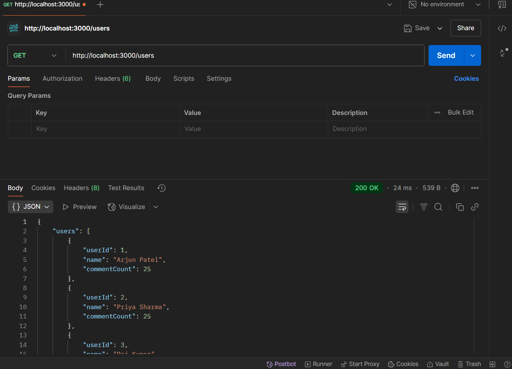

# Social Media Analytics Microservice

This is a Node.js-based microservice that provides analytics for a social media platform. It includes endpoints for retrieving top users based on engagement and popular/latest posts.

## Features

- Get top 5 users based on comment engagement
- Fetch latest posts
- Fetch most popular posts by comment count
- View comments for specific posts

## Setup

1. Install dependencies:
```bash
npm install
```

2. Start the server:
```bash
npm start
```

For development with auto-reload:
```bash
npm run dev
```

## API Endpoints

- GET `/users` - Returns top 5 users based on comment engagement
- GET `/posts?type=latest` - Returns 5 most recent posts
- GET `/posts?type=popular` - Returns posts with highest comment count
- GET `/posts/:postId/comments` - Returns comments for a specific post

## API Testing Screenshots

### Top Users Endpoint


### Latest Posts Endpoint


### Popular Posts Endpoint


### Post Comments Endpoint


## Tech Stack

- Express.js
- Node-fetch
- CORS middleware

## Project Structure

```
├── server.js           # Main application file
├── package.json        # Project configuration
├── package-lock.json   # Dependency lock file
└── .gitignore         # Git ignore configuration
```