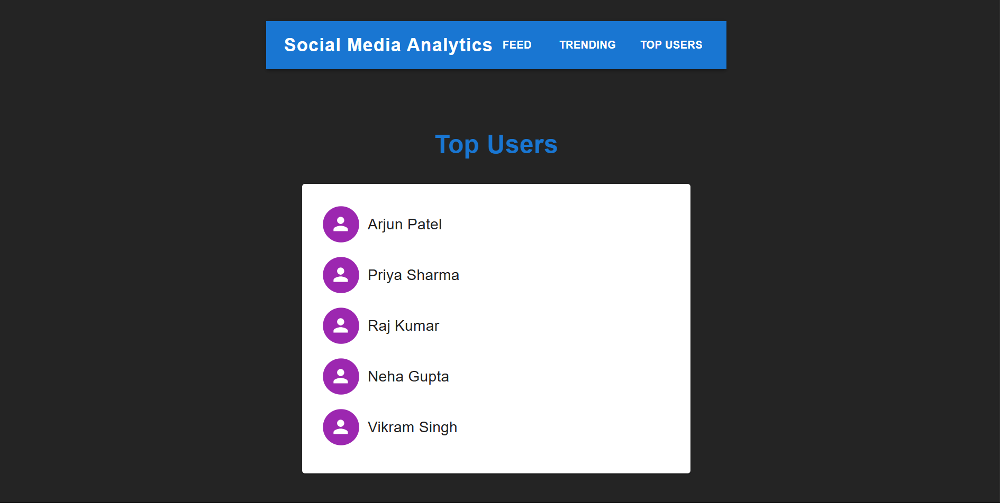

# Social Media Analytics Dashboard

A modern, responsive React application for visualizing social media analytics, built with React, TypeScript, and Material-UI.

## Features

- Real-time feed of latest posts
- Trending posts analytics
- Top users leaderboard
- Responsive design for mobile and desktop
- Material-UI components for a polished look
- TypeScript for type safety

## Screenshots

### Web View


### Mobile View


## Getting Started

### Prerequisites

- Node.js (v14 or higher)
- npm or yarn

### Installation

1. Clone the repository
2. Install dependencies:
   ```bash
   npm install
   ```
3. Start the development server:
   ```bash
   npm run dev
   ```

## Technology Stack

- React 18
- TypeScript
- Vite
- Material-UI
- React Router

## Project Structure

```
src/
  ├── components/     # React components
  ├── assets/         # Static assets
  ├── App.tsx         # Main application component
  └── main.tsx        # Application entry point
```

## Development

The project uses Vite for fast development with HMR (Hot Module Replacement) support.

- `npm run dev` - Start development server
- `npm run build` - Build for production
- `npm run preview` - Preview production build
